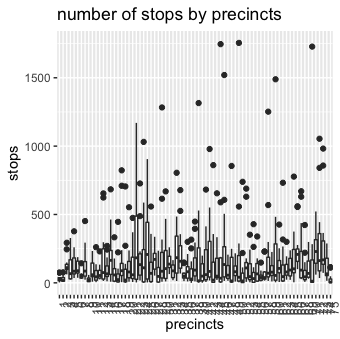
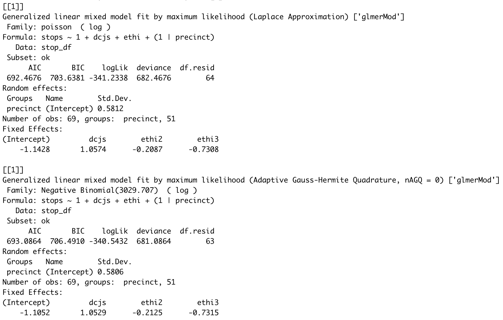
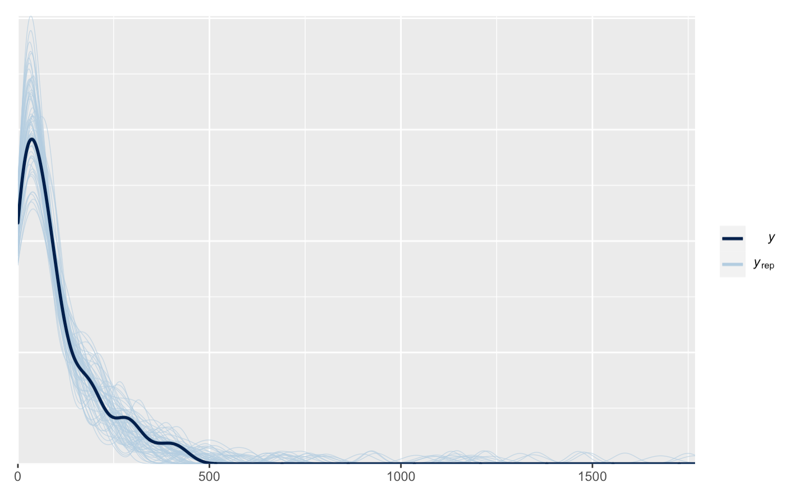
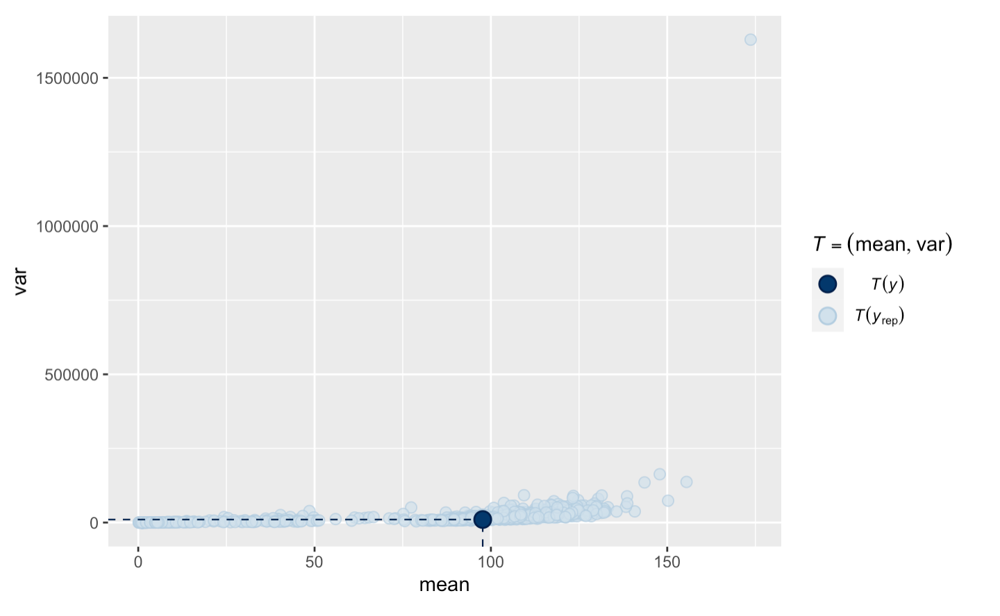
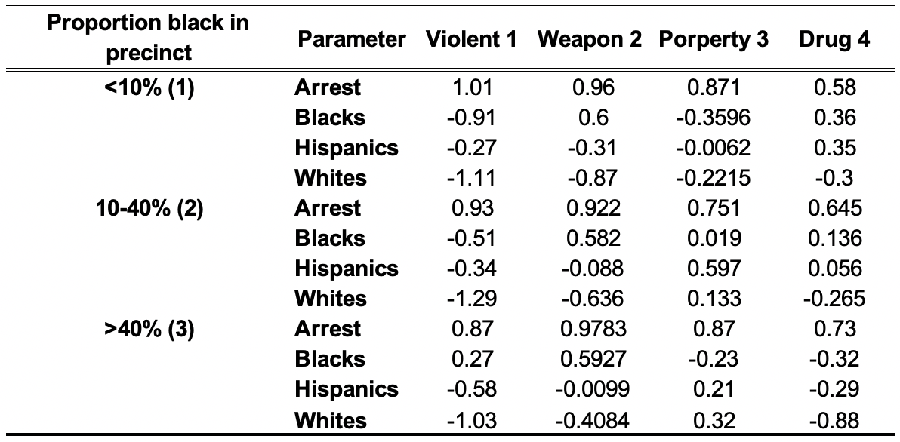
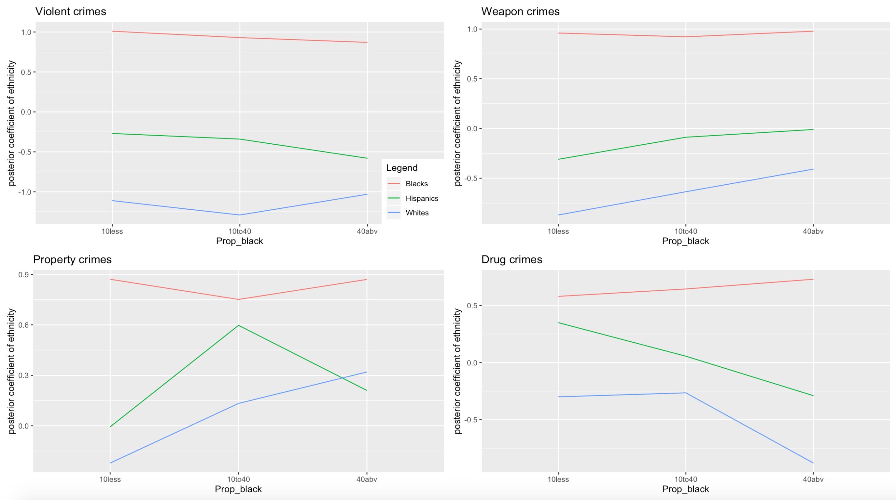
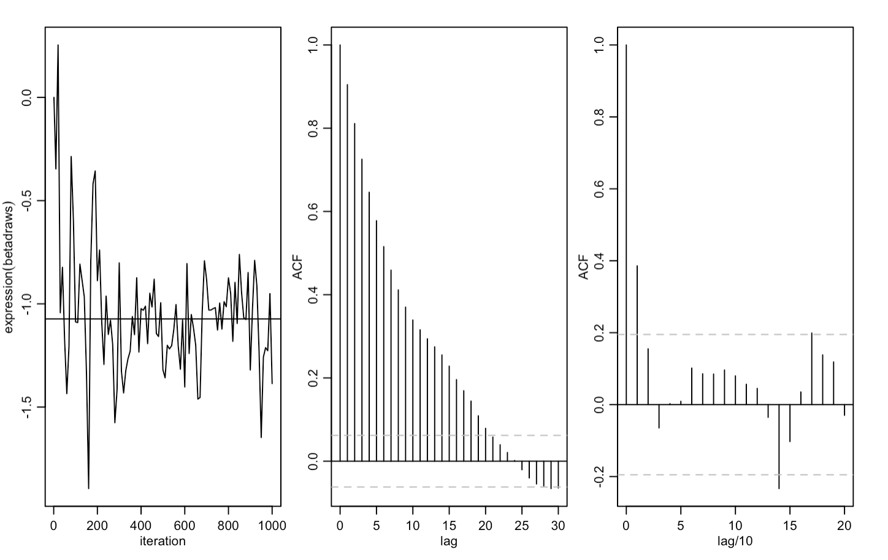
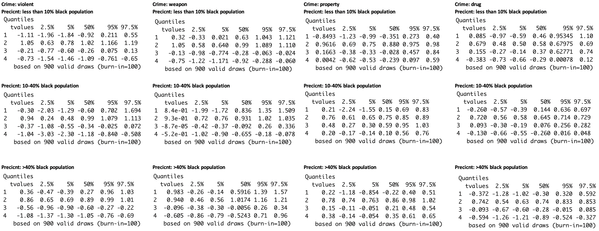

```{r setup, include=FALSE}
knitr::opts_chunk$set(echo = TRUE)
```

## Lynn Fan, Cindy Wang, Evelyn Yun

## Introduction 

### (i) Background Information

Racial profiling in policing has always been a huge point of contention. It is defined as police practice that relies on certain racial characteristics they believe to be associated with crime. This issue is especially prominent in selective policing strategies such as "stop-and-frisk", i.e. deciding which pedestrains to search, question, or frisk, a program in New York City that has caused numerous civil rights controversies. Police have defended the strategy by claiming that, while stop-rates are higher for non-white citizens, it only reflects reasonable prior knowledge or experience such as historic crime rates by race, or that other counfounding factors such as variation between precincts (neighbourhoods).

### (ii) Goals, relevant issues, and challenges 

Our goal is to find out whether minorities (black and hispanic citizens) are disproportionately targeted even when taking into account to historic crime rates (approximated by arrest rates from the previous year) and variances in precinct as a random effect. To do this, we take the approach of modelling stop rates based on previous year's arrests, categorized by ethnicity and crime type, while making precinct a random effect in the sampling model. We then examine the coefficients of the posterior distribution to see whether past year's crimes would affect minority and white group stop rates in a similar way. 



### (iii) Data source, cleaning, variables description, and limitations in the data 

Our data source is the stop-and-frisk dataset compiled by Andrew Gelman and Jennifer Hill in his book, and can be found [at this site](http://www.stat.columbia.edu/~gelman/arm/examples/police/frisk_with_noise.dat). It contains the times pedestrains are stopped in each of hte 75 precincts in New York City in 2005. We benefitted from his work and hence no further cleaning is necessary.
Every row is a precinct's number of stops for a specific ethnicity and crime type, i.e. one precinct's total number of stops are spread across several rows. The following variables are in the dataset:

_Numerical variables:_
+ stops: the number of stops for a specific ethnicity and crime type, specified by crime and eth variables in the same row 
+ pop: population of a specific ethnicity in the precinct specified by the precinct variable in the same row 
* past.arrests: the number of arrests in the previous year for the ethnicity and crime type specified by crime and eth variables in the same row

_Factor variables:_
* precinct: numbered from 1-75
* eth: 1=black, 2=hispanic, 3=white
* crime: 1=violent, 2=weapons, 3=property, 4=drug

## Initial EDA and sampling model specification 

Since our data is count data, it is reasonable to use either the Poisson or Negative Binomial distribution for the sampling model. We realized by running quick summary statistics on response variable stop rate that there is overdispersion, i.e. the variance of 47254 is far greater than the mean of 146. This gives us the idea that Negative Binomial distribution is more appropriate to account for overdispersion factors. We also do not have any zero values, so zero-inflated versions of Poisson or Negative Binomial are not applicable. We validated this by fitting a Poisson and Negative Binomial regression model with precinct as the random effect, and by comparing the AIC/BIC it shows that indeed the Negative Binomial is a much better model fit. 




We also want to divide up the precincts by the portion of black population in it, as we want to account for previous police claims that relate to the demographics of a precinct. For example, police claim that they are more likely to stop black pedestrians in the case where the black pedestrian is in a predominantely white neighbourhood, and vice versa. Hence, by categorizing precincts based on the proportion of black population, we can use it to examine if disproportionate stopping of minorities still exists in predominantely white or black neighborhoods. Hence we created the variable `pblack` which categorizes precincts with <10%, 10-40%, or > 40% black population. 

Next, we want to incorporate the hiearchial element into the model, as we have 3 different precinct categories (<10%, 10-40%, or > 40% black population) and 4 different crime types (violent, weapons, property, drug). Previous literature has suggested that police reports having different strategies for different precinct, for example being more aggressive towards stopping pedestrains in high crime precincts, or having higher stop rates because some crime types are easier to spot than others. Hence, it is not ideal to do regression without distinguishing effects of different precincts and crime types. This calls for a hiearchial Negative Binomial program as follows: 

$\lambda$ = mean, $\alpha$ = over-dispersion factor 

\[
\lambda_p= exp(\vec{x^T\beta_p})\\
\begin{eqnarray}
Y_{ep}|\lambda_p, \alpha_e & \sim & NB(\lambda_p \alpha_e)\\ 
\end{eqnarray} \\
Pr(Y_{ep} = y_{ep}|\lambda_p,\alpha_e) = \frac{\Gamma(y_{ep} + \alpha_e^{-1})}{\Gamma(\alpha_e^{-1})\Gamma(y_{ep} + 1)}(\frac{1}{1+ \alpha_e\lambda_p})^{a^{-1}}(\frac{\alpha_e\lambda_p}{1+\alpha_e\lambda_p})^y_{ep}
\]

As for the variable past.arrest (last year's arrest rate), we scale by the factor of 15/12 to account for the fact that we have 15 months of stop data but only 12 months of arrest data. 

## Methodology for prior and posterior

We have 12 sampling models defined by different combinations of 3 precinct categories and 4 crime types. We assign Normal distribution distribution as the prior for regression coefficient $\beta$ as it is continuous and takes range from negative to positive infinity. We also assign Gamma distribution as the prior for over-dispersion factor $\alpha$ as it is continuous and positive.

\[
\begin{eqnarray} 
\beta_p & \sim & \mathrm{N}(\overline{\beta}, A^{-1})\\
\alpha_e & \sim & Gamma(a,b)\\
\end{eqnarray}
\]

We generate 12 posterior distributions on the parameters $\beta$ and $\alpha$. We conduct separate comparisons for violent crimes, weapons offenses, property crimes, and drug crimes. For each, we model the number of stops by ethnic group "e" and precinct "p" for that crime type, using as a baseline the DCJS arrest count nep for that ethnic group, precinct, and crime type. 

## Posterior predictive checks

Generate chain of MCMC samples of parameters $\beta$ and $\alpha$ from 12 posterior distributions using metropolis algorithm. Since our goal is to predict stop rate for this year in order to compare to last year's arrest rate, we could simulate the predictive distribution $[Z|data]$ using the posterior distribution $[\beta|data]$. Based on the joint distribution of Z, $\beta$ and $\alpha$: 

\[
[Z, \beta, \alpha|data] \propto [Z|data, \beta, \alpha][\beta|data]\\
=[Z|\beta, \alpha][\beta|data]
\]

 1. Draw S samples $\beta_1$, ..., $\beta_S$ from the posterior distribution $[\beta|data]$.
 2. Conditional on each posterior sample $\beta_s$, draw a sample $Z_s$ from the Negative Binomial sampling model.
 
The resulting samples will be $(Z_1, \beta_1), ..., (Z_S, \beta_S)$. Ignoring $\beta$, we generate posterior predive samples of $Z$. By comparing simulated samples with real data, we realize the posterior distribution tends to shrink towards 0 from positive side, with longer but thinner tails than the real distribution of data. It implies our posterior model is likely to predict more precincts with extreme stop rate, while failing to capture the trend of precincts with moderate stop rate. For most of the time, our model learns the variability of tails sufficiently. It captures the average stop rate for different precinct categories and crime types pretty well, although with comparatively large variance. 

The resulting samples will be $(Z_1, \beta_1), ..., (Z_S, \beta_S)$. Ignoring $\beta$, we generate posterior predictive samples of $Z$.

Below are the posterior predictive checks for violent crimes in precincts with less than 10% African American population as an example, while the remaining 11 checks are put in the appendix. Our model captures the majority of the actual stops well, but doesn't have a very accurate grasp on the outliers. The variances of our predicted stops also varies more than we expected, but the actual mean is centered around the middle point of our predicted cases, so we think our model is a good fit overall.




## Interpretations and conclusions 






1) Black people are stopped more frequently for all crime types except for property crimes across precincts with different proportion of black population, save for property crime and violent crime in majority non-black neighbourhoods. Notably, in precicnts with majority black population (40% and above), the coefficients for the effect of ethnicity on chance of being stopped for violent crimes are negative for hispanics and whites, but not for blacks; i.e. being black uniquely leads to a higher chance of being stopped for violent crimes in majority black neighborhoods. This is an interesting contrast to police statement that they are more likely to do "racial incongruity" stops. i.e. having high chances of minority stops in predominantely white precincts. 

2) for precincts with 10-40% black population, whites are on average more than 3x less likely to be stopped for violent crimes with the same past year arrest rate for that ethnicity, with a average coefficient of -1.29 for blacks and -0.51 whites. Notably, this coefficient is also significant at the 95% credible interval with coefficient (-3.03, -0.840).

3) for property crime in a precinct with more than 40% black population, whites are always more likely to be targeted than blacks within a 95% credible interval. The coefficient for black is (-1.35, 0.43), and the coefficient for whites is (0.047, 0.68). However, whites are the least likely to be stopped for all other crime types regardless of precinct black population percentage except for property crime.

4) for precincts with over 40% black population, black people are on average 1.4-1.5x more likely to be stopped from drug crimes than hispanics and whites.

5) the coefficients of dcjs (the number of arrests last year) are consistent across different crime types and precinct categories, as the 95% credible interval of coefficient is roughly (0.5, 1) all around. i.e. for all races, previous year's arrest rate for their race makes it more likely for pedestrians of that race to be stopped.

We analyze the stop rates at which New Yorkers of different ethinicy were stopped by the police on the city streets, to assess the central claim that race-specific stop rates reflect nothing more than race-specific crime rates. We aim to assess whether police have reasonable prior knowledge such as historic arrest rates by race to justify their action to stop black more frequently than non-black, or the trend to do "racial congruity stops" for different ethnicities without specifically discriminating against black. From our model, we conclude that historic arrest rates have no impact on stop rates of different racial groups across all crime types as it is approximately consistent. Moreover, whites are the least likely to be stopped for all crime types regardless of precinct balck population, except for property crime which we believe is less likely to be influenced by racial profiling. We conclude that members of minority groups, especially black were stopped more often than whites, both in comparison to their overall population and to the estimated rates of crime that they have committed. 
## MCMC convergence and mixing diagnostics 

We conducted convergence check for our posterior samples of the coefficients, and it appears that convergence occured at about 100-200 iterations. Hence, we threw out the first 100 draws that are burn-ins and retained 900 valid draws for each of our 12 models. The right panel shows our attempt at thinning the samples because they are not indpendent and identically distributed. However, given we started out with high variance and overdispersion, and we do not really have storage concerns, so we decided against thinning.



## Limitations

### (i) Limitations of the data 

missing predictors, overdispersion, impossible to have every single predictor (i.e. every single factor the police considers when making a stop), that would include factors like age and gender of the pedestrain as well as many circumstantial cues. 

### (ii) Limitation of the analysis 

controlled for precinct to precinct variation and crime type, but not population and/or demographics. However, there is already plenty literature that demonstrate that minority groups are stopped more oftan even when taking into account their overall population, including nuanced analysis done by taking into account day and mnight population changes to account for commerical and business activity.

### Appendix: 



### References:
1. Index of /~gelman/arm/examples/police. Accessed April 20, 2020. http://www.stat.columbia.edu/~gelman/arm/examples/police/.
2. “Bayesplot: Plotting for Bayesian Models - Bayesplot-Package.” - bayesplot-package • bayesplot. Accessed April 25, 2020. http://mc-stan.org/bayesplot/reference/bayesplot-package.html.
3. Mehrad Mahmoudian [aut, cre]. “To.dummy: Convert Categorical Vector into Dummy Binary Dataframe in Varhandle: Functions for Robust Variable Handling.” to.dummy: Convert categorical vector into dummy binary dataframe in varhandle: Functions for Robust Variable Handling, February 21, 2020.
4. Rossi, Peter. “RnegbinRw: MCMC Algorithm for Negative Binomial Regression in Bayesm: Bayesian Inference for Marketing/Micro-Econometrics.” rnegbinRw: MCMC Algorithm for Negative Binomial Regression in bayesm: Bayesian Inference for Marketing/Micro-Econometrics, October 30, 2019. 
5. “R Code 8 / Metropolis Hastings Steps.” R Code 8 / Metropolis Hastings Steps | Jeff Rouder. Accessed April 25, 2020. http://pcl.missouri.edu/jeff/node/322.
6. 262588213843476. “R Code to Run an **MCMC** Chain Using a **Metropolis-Hastings** Algorithm with a Gaussian Proposal Distribution. Although There Are Hundreds of These in Various Packages, None That I Could Find Returned the Likelihood Values along with the Samples from the Posterior Distribution. However, If You Have These Likelihood Values, It's Very Easy to Calculate an Estimate of the **Marginal Likelihood** and the **Deviance Information Criterion**.” Gist. Accessed May 25, 2020. https://gist.github.com/gaberoo/4619102.
7. user321627user321627 1, and Xi'anXi'an 70k88 gold badges118118 silver badges471471 bronze badges. “What Is a Hierarchical Model That Can Estimated via the Metropolis-Hastings Algorithm but Not the Gibbs Sampler?” Cross Validated, November 1, 1966. https://stats.stackexchange.com/questions/261552/what-is-a-hierarchical-model-that-can-estimated-via-the-metropolis-hastings-algo.
8. StevenVDLStevenVDL 1122 bronze badges. “MCMC Metropolis-Hastings Sampler - Estimation of Multiple Parameters.” Cross Validated, February 1, 1969. https://stats.stackexchange.com/questions/411321/mcmc-metropolis-hastings-sampler-estimation-of-multiple-parameters.
9. “Tutorial - Bayesian Negative Binomial Regression from Scratch in Python.” Tutorial - Bayesian negative binomial regression from scratch in python | Kieran R Campbell - blog. Accessed April 25, 2020. https://kieranrcampbell.github.io/blog/2015/03/31/tutorial-bayesian-nb-regression.html.
10. Curran, James M. “BivnormMH: Metropolis Hastings Sampling from a Bivariate Normal... in Bolstad2: Bolstad Functions.” bivnormMH: Metropolis Hastings sampling from a Bivariate Normal... in Bolstad2: Bolstad functions, May 2, 2019. https://rdrr.io/cran/Bolstad2/man/bivnormMH.html.
11. “SamplerCompare Source: R/Metropolis.R.” SamplerCompare source: R/metropolis.R. Accessed April 25, 2020. https://rdrr.io/cran/SamplerCompare/src/R/metropolis.R.
12. R: Metropolis Algorithm. Accessed April 20, 2020. http://www.stat.umn.edu/geyer/8701/package/mcmc.Rcheck/mcmc/html/metropolis.html.
13. Neel. “R Code for Multivariate Random-Walk Metropolis Sampling.” One Life, June 24, 2017. https://blog.abhranil.net/2014/02/08/r-code-for-multivariate-random-walk-metropolis-hastings-sampling/.
14. “Stop-and-Frisk in New York City.” Wikipedia. Wikimedia Foundation, April 12, 2020. https://en.wikipedia.org/wiki/Stop-and-frisk_in_New_York_City.
15. KgeorKgeor 1, and Xi'anXi'an 70k88 gold badges118118 silver badges471471 bronze badges. “Metropolis-Hastings in a Bayesian Hierarchical Model.” Cross Validated, May 1, 1968.https://stats.stackexchange.com/questions/361501/metropolis-hastings-in-a-bayesian-hierarchical-model.
16. Bolker, Ben. GLMM FAQ, January 9, 2020. https://bbolker.github.io/mixedmodels-misc/glmmFAQ.html#fitting-models-with-overdispersion.
17. Burke. N.(2018), "Metropolis, Metropolis-Hastings and Gibbs Sampling Algorithms", Lakehead University Press
18. Gelman, Andrew, Fagan, Jefferey, Alex, Kiss, "An Analysis of the New York City Police Department's 'Stop-and-Frisk' Policy in the Context of Claims of Racial Bias." Journal of the American Statistical Association, September 2007, Vol 102, No. 479, Applications and Case Studies, DOI 10.1198/016214506000001040
